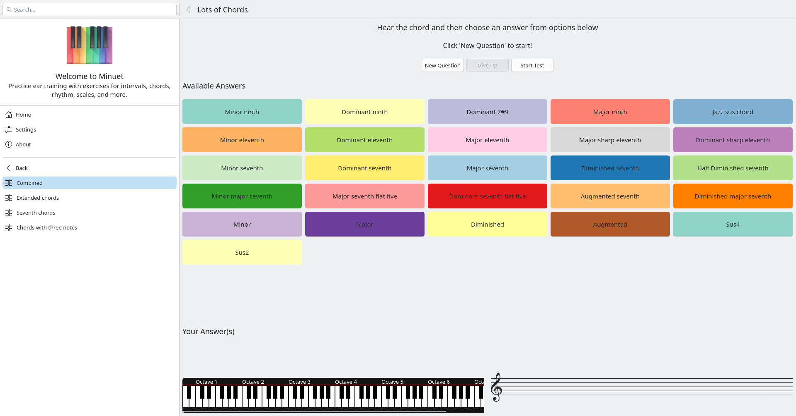

# Minuet

Minuet is KDE's free and open-source music education application. It helps
learners practise ear training and music-reading skills through interactive
exercises for intervals, chords, scales, rhythm, singing, and clapping. It is
designed for self-directed practice as well as classroom use.



## Build with kde-builder

On Linux, [kde-builder](https://develop.kde.org/docs/getting-started/building/kde-builder-setup/)
is the recommended way to build Minuet and the KDE dependencies it needs. The
first build may take some time because it also builds missing dependencies.

Install `git` and `uv`, then perform this one-time setup:

```sh
uv tool install git+https://invent.kde.org/sdk/kde-builder.git
kde-builder --generate-config
kde-builder --install-distro-packages
```

Build Minuet and run the version installed by kde-builder:

```sh
kde-builder minuet
kde-builder --run minuet
```

By default, kde-builder checks sources out under `~/kde/src`, builds them under
`~/kde/build`, and installs them under `~/kde/usr`. When working in an existing
Minuet checkout, create a branch named `work/...`; kde-builder then preserves
your local source changes. For subsequent builds, use:

```sh
kde-builder minuet --no-include-dependencies
```

See KDE's [building guide](https://develop.kde.org/docs/getting-started/building/kde-builder-compile/)
for configuration, troubleshooting, and advanced workflows.

# Store assets

Store assets are intentionally separated by consumer:

- `org.kde.minuet.metainfo.xml` is the canonical source for shared listing copy and
  Windows/desktop screenshot URLs.
- `fastlane/metadata/org.kde.minuet/en-US/images/` contains Android publishing
  assets. Place the six phone screenshots in `phoneScreenshots/`, numbered from
  `01-exercise-library.png` through `06-practice-settings.png`.
- The six Windows/desktop screenshots live in the separate
  [`product-screenshots`](https://invent.kde.org/websites/product-screenshots)
  repository under `minuet/`. They are deployed to `cdn.kde.org` before their
  URLs are added to AppStream.
- `src/app/icons/windows/` contains only Windows Store tile and hero artwork; it
  must not contain screenshots.
- `doc/` contains handbook illustrations only, and is not a source of store
  images.
- Apple upload screenshots are staged locally in
  `build/store-assets/apple/{iphone,ipad,macos}/`; they are intentionally not
  committed. The source-controlled iOS and macOS asset catalogs contain only
  app and launch icons.

Validate assets before publishing:

    python3 scripts/validate-store-assets.py
    python3 scripts/validate-store-assets.py \
        --product-screenshots-root /path/to/product-screenshots \
        --apple-staging-root build/store-assets/apple --require-all

For a Mac App Store archive, configure with
`-DMINUET_MAC_APP_STORE=ON`. The default macOS build remains the direct
Developer-ID distribution path and does not opt into App Sandbox.
