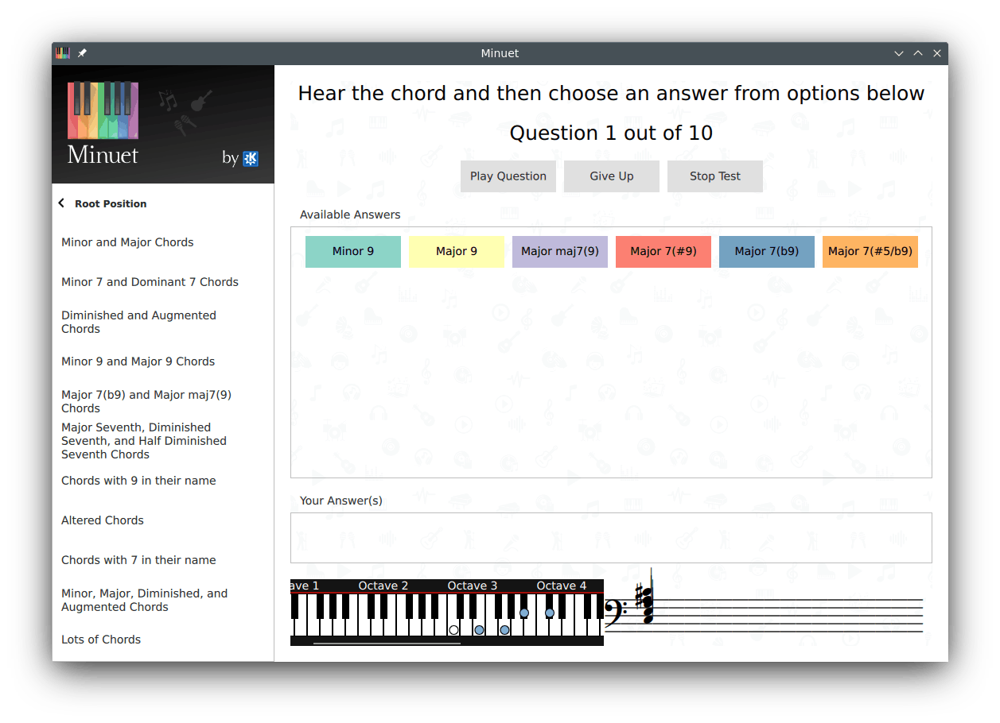

# About Minuet

Welcome to Minuet: the KDE software for music education. Minuet aims at supporting students and teachers in many aspects of music education, such as ear training, first-sight reading, solfa, scales, rhythm, harmony, and improvisation. Minuet makes extensive use of MIDI capabilities to provide a full-fledged set of features regarding volume, tempo, and pitch changes, which makes Minuet a valuable tool for both novice and experienced musicians.

Minuet features a rich set of ear training's exercises and new ones can be  seamlessly added in order to extend its functionalities and adapt it to several music education contexts.

# How to build Minuet

    install KDE Frameworks and Drumstick
    $ git clone https://invent.kde.org/education/minuet
    $ cd minuet
    $ mkdir build
    $ cd build
    $ cmake -DCMAKE_INSTALL_PREFIX=$KDEDIRS -DCMAKE_BUILD_TYPE=Debug ..
    $ make
    $ make install  or  su -c 'make install' or sudo make install

where $KDEDIRS points to your KDE installation prefix.

Note: you can use another build path. Then cd in your build dir and:

    $ export KDE_SRC=path_to_your_src
    $ cmake $KDE_SRC -DCMAKE_INSTALL_PREFIX=$KDEDIRS -DCMAKE_BUILD_TYPE=Debug

# How to Create Minuet Screencasts

1) Start Minuet using qsynth as backend.
2) Qsynth should be configured to use pulseaudio as audio backend.
3) Make sure minuet MIDI output port is connected to qsynth.
4) Use simplescreenrecorder application with pulseaudio backend, "Monitor of Built-in Audio Analog Stereo" source, MP4 container, and MP3 codec (256 bitrate).
